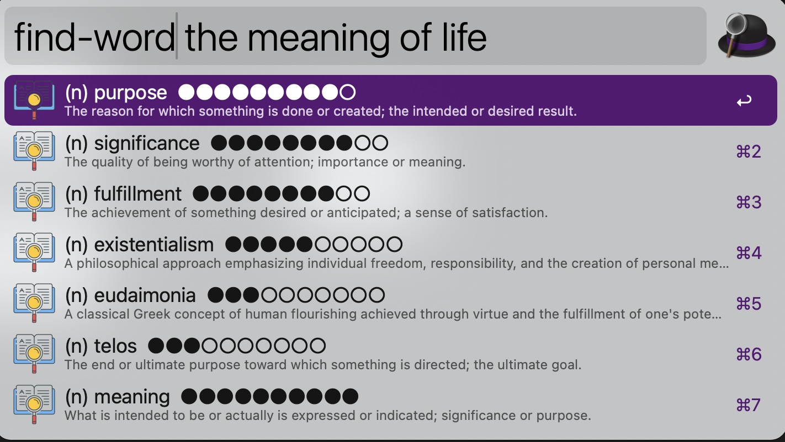
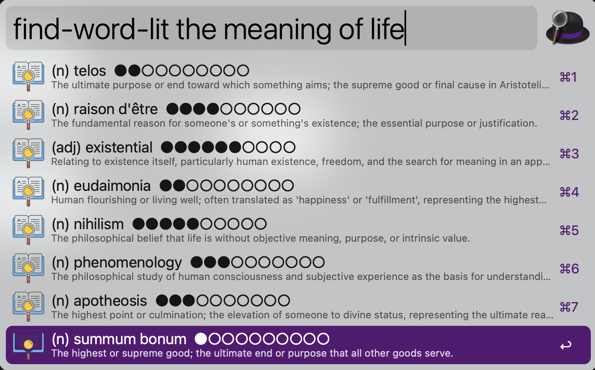

# Find Word - Alfred Workflow

A reverse dictionary Alfred workflow powered by Claude AI. Find words based on their meanings or descriptions, with optional literary mode for more sophisticated vocabulary.

## Screenshots

### Regular Mode
Search for words by describing their meaning:



### Literary Mode
Get more sophisticated, eloquent vocabulary:



## Features

### Core Functionality
- **Reverse Dictionary Lookup**: Describe what you mean, get word suggestions
- **Literary Mode**: Get more sophisticated, eloquent word suggestions
- **Smart Definitions**: Each word comes with a concise definition
- **Fast Results**: Powered by Claude AI for intelligent matching

### Visual Enhancements
- **Part of Speech Labels**: Clear abbreviations (n) noun, (v) verb, (adj) adjective, (adv) adverb
- **Usage Frequency Indicator**: Subtle dots (●●●●○○○○○○) showing how commonly used (1-10 scale)
- **Word Origin Flags**: 🇻🇦 Latin, 🇬🇷 Greek, 🇫🇷 French, 🇩🇪 Germanic (shown in etymology view)

### Interactive Modifiers
- **Shift + Enter**: View synonyms and antonyms for the selected word
- **Ctrl + Enter**: View etymology and word origin history

## Installation

### 1. Clone or Download

```bash
git clone https://github.com/erstaples/alfred-workflow-find-word.git
# or download and extract the zip
```

### 2. Install Python Dependencies

```bash
pip3 install anthropic
```

### 3. Build and Import to Alfred

Build the workflow package and install it:

```bash
cd alfred-workflow-find-word
make install
```

This will create `Find Word.alfredworkflow` and open it for installation in Alfred.

Alternatively, you can:
- Run `make build` to just create the package
- Double-click `Find Word.alfredworkflow` manually to install

### 4. Get Your Claude API Key

1. Go to [Anthropic Console](https://console.anthropic.com/)
2. Sign in or create an account
3. Navigate to **API Keys** in the left sidebar
4. Click **Create Key**
5. Give it a name (e.g., "Alfred Find Word")
6. Copy the API key (you won't be able to see it again!)

### 5. Configure Environment Variables in Alfred

After importing the workflow and getting your API key:

1. Open Alfred Preferences → Workflows
2. Select the "Find Word" workflow
3. Click the **[x]** button in the top right corner (Configure Workflow)
4. Set the following variables:
   - **Name**: `ANTHROPIC_API_KEY`
   - **Value**: Paste your API key from step 4 above

5. (Optional) Add another variable for a different model:
   - **Name**: `CLAUDE_MODEL`
   - **Value**: `claude-3-5-sonnet-20240620` (or [another model](https://docs.claude.com/en/docs/about-claude/models/overview#choosing-a-model))
   - Leave blank to use the default: `claude-haiku-4-5-20251001`

## Usage

### Regular Mode
```
find-word to make unnecessary
```
Returns: `obviate`, `preclude`, `eliminate`, etc.

### Literary Mode
```
find-word-lit sad
```
Returns: `melancholy`, `wistful`, `forlorn`, `plaintive`, etc.

### Using Modifiers

When viewing results, you can use modifier keys to see additional information:

- **Hold Shift**: Shows synonyms and antonyms for the word
- **Hold Ctrl**: Shows etymology and word origin history

Simply hold the modifier key and press Enter to copy the word to your clipboard.

## Visual Guide

Each result shows:
- **Title Line**: Part of speech + word + frequency indicator
  - Abbreviation shows grammatical role: (n) (v) (adj) (adv) (prep) etc.
  - Dots show frequency (●●●●○○○○○○ = 4/10, moderately rare)
- **Subtitle Line**: Clean definition without clutter
  - Full definition text with maximum space

Example result:
```
(v) obviate  ●●●○○○○○○○
To remove or prevent (a need or difficulty); make unnecessary.
```

Hold **Ctrl** to see: `🇻🇦 Latin • Etymology and word origin details`

This clean layout maximizes definition space while keeping essential info visible.

## Examples

| Query | Results |
|-------|---------|
| `find-word to make worse` | exacerbate, aggravate, worsen |
| `find-word-lit beautiful` | resplendent, pulchritudinous, ethereal |
| `find-word brief and to the point` | concise, succinct, terse, laconic |
| `find-word-lit peaceful` | serene, tranquil, halcyon, placid |

## How It Works

1. You type a description of the word you're looking for
2. The workflow sends your description to Claude AI
3. Claude analyzes your description and returns relevant words
4. In literary mode, Claude prioritizes sophisticated, eloquent vocabulary
5. Each word is returned with a concise definition
6. Results are ranked by relevance to your description

## Configuration

### Adjusting Number of Results

Edit `find_word.py` and modify the system prompt:

```python
system_prompt = f"""...
Provide 5-10 words ranked by relevance."""  # Change to your preferred range
```

### Changing Claude Model

To use a different Claude model:

1. Open Alfred Preferences → Workflows
2. Select "Find Word" workflow
3. Click the **[x]** button (Configure Workflow)
4. Add or edit the `CLAUDE_MODEL` variable
5. Set it to one of the available models below

Available models:
- `claude-haiku-4-5-20251001` (default, fast and cheap)
- `claude-3-5-sonnet-20240620` (more capable, balanced)
- `claude-3-opus-20240229` (most capable, slower, more expensive)
- `claude-3-haiku-20240307` (older haiku version)

For detailed information about model capabilities, performance, and pricing, see the [Claude Models Overview](https://docs.claude.com/en/docs/about-claude/models/overview#choosing-a-model).

## Troubleshooting

### "anthropic package not installed"
Run: `pip3 install anthropic`

### "ANTHROPIC_API_KEY environment variable not set"
1. Open Alfred Preferences → Workflows → Find Word
2. Click the **[x]** button (Configure Workflow)
3. Verify `ANTHROPIC_API_KEY` is set with your API key
4. If you just added it, restart Alfred completely (quit and reopen)

### No results or errors
1. Check your API key is valid
2. Verify you have API credits remaining
3. Check your internet connection
4. View Alfred's debug console (workflow view → bug icon)

## Customization

### Adding an Icon

Add an `icon.png` file (512x512 recommended) to the workflow folder. Alfred will automatically use it.

### Modifying Keywords

Edit `info.plist` and change the `<key>keyword</key>` values under each script filter object.

## Development

### Quick Start for Development

For development, you can automatically inject your API key into builds without committing it:

1. **Create your environment file**:
   ```bash
   cp .env.example .env
   ```

2. **Edit `.env` with your API key**:
   ```bash
   # .env
   ANTHROPIC_API_KEY=sk-ant-...your-key-here
   CLAUDE_MODEL=claude-haiku-4-5-20251001
   ```

3. **Build and install with development environment**:
   ```bash
   make install-dev
   ```

This will automatically inject your API key into the workflow, so you don't have to manually configure it in Alfred's UI each time you rebuild.

### Makefile Commands

```bash
make build        # Build the workflow package (production)
make build-dev    # Build dev version with injected API key from .env
make clean        # Remove all workflow packages
make install      # Build and open for installation
make install-dev  # Build dev version and install
make help         # Show available commands
```

**Note:** The dev build creates `Find Word-dev.alfredworkflow` which contains your API key and is automatically gitignored, so you can't accidentally commit it.

### Development Workflow

1. Make changes to `find_word.py`
2. Run `make install-dev` to rebuild and install
3. Test in Alfred
4. Repeat

The `.env` file is gitignored, so your API key is never committed.

### Project Structure

```
find-word-alfred-plugin/
├── assets/                        # Screenshots and documentation images
│   ├── find-word-example.png
│   └── find-word-lit-example.png
├── find_word.py                  # Main workflow script
├── info.plist                    # Alfred workflow configuration
├── icon.png                      # Workflow icon
├── inject_env.py                 # Development tool for API key injection
├── requirements.txt              # Python dependencies
├── Makefile                      # Build automation
├── .env.example                  # Environment variables template
├── Find Word.alfredworkflow      # Production build (tracked in git)
├── Find Word-dev.alfredworkflow  # Dev build with API key (gitignored)
└── README.md                     # This file
```

## Cost Considerations

This workflow uses the Claude API, which is paid:
- Each query with Claude Haiku 4.5 (default) costs approximately $0.0002-0.0005
- The enhanced features (etymology, synonyms, etc.) use ~2x tokens compared to basic lookup
- For even better quality results, use Claude 3.5 Sonnet (~$0.002-0.006 per query)
- The default Haiku model provides excellent results at minimal cost
- Typical usage: 100 queries ≈ $0.02-0.05 with Haiku

## Contributing

Issues and pull requests welcome!

## License

MIT License - feel free to modify and share

## Credits

Created by estaples
Powered by [Anthropic Claude](https://www.anthropic.com/)
